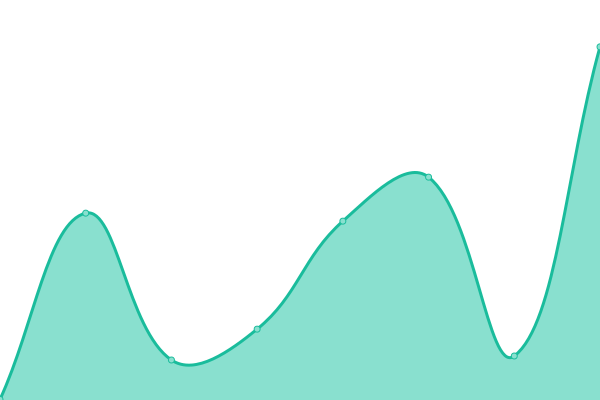

# [📈 Live Status](https://upptime.360psg.net): <!--live status--> **🟩 All systems operational**

This repository contains the open-source uptime monitor and status page for [360 PSG](https://www.360psg.com), powered by [Upptime](https://github.com/upptime/upptime).

With [Upptime](https://upptime.js.org), you can get your own unlimited and free uptime monitor and status page, powered entirely by a GitHub repository. We use [Issues](https://github.com/upptime/upptime/issues) as incident reports, [Actions](https://github.com/360psg/upptime/actions) as uptime monitors, and [Pages](https://demo.upptime.js.org) for the status page.

<!--start: status pages-->
<!-- This summary is generated by Upptime (https://github.com/upptime/upptime) -->
<!-- Do not edit this manually, your changes will be overwritten -->
<!-- prettier-ignore -->
| URL | Status | History | Response Time | Uptime |
| --- | ------ | ------- | ------------- | ------ |
|  [Google](https://www.google.com) | 🟩 Up | [google.yml](https://github.com/360PSG/upptime/commits/HEAD/history/google.yml) | 

 72ms
     
 | 

<a href="https://upptime.360psg.net/history/google">100.00%</a>
    

|  [Wikipedia](https://en.wikipedia.org) | 🟩 Up | [wikipedia.yml](https://github.com/360PSG/upptime/commits/HEAD/history/wikipedia.yml) | 

 289ms
     
 | 

<a href="https://upptime.360psg.net/history/wikipedia">100.00%</a>
    

|  [360 PSG](https://www.360psg.com) | 🟩 Up | [360-psg.yml](https://github.com/360PSG/upptime/commits/HEAD/history/360-psg.yml) | 

 824ms
     
 | 

<a href="https://upptime.360psg.net/history/360-psg">100.00%</a>
    

|  [360PSG DNS1](ns1.360psg.com) | 🟩 Up | [360-psg-dns-1.yml](https://github.com/360PSG/upptime/commits/HEAD/history/360-psg-dns-1.yml) | 

 64ms
     
 | 

<a href="https://upptime.360psg.net/history/360-psg-dns-1">100.00%</a>
    

|  [360PSG DNS2](ns2.360psg.com) | 🟩 Up | [360-psg-dns-2.yml](https://github.com/360PSG/upptime/commits/HEAD/history/360-psg-dns-2.yml) | 

 50ms
     
 | 

<a href="https://upptime.360psg.net/history/360-psg-dns-2">100.00%</a>
    

<!--end: status pages-->

[**Visit our status website →**](https://demo.upptime.js.org)

## 📄 License

- Powered by: [Upptime](https://github.com/upptime/upptime)
- Code: [MIT](./LICENSE) © [Upptime](https://upptime.js.org)
- Data in the `./history` directory: [Open Database License](https://opendatacommons.org/licenses/odbl/1-0/)
